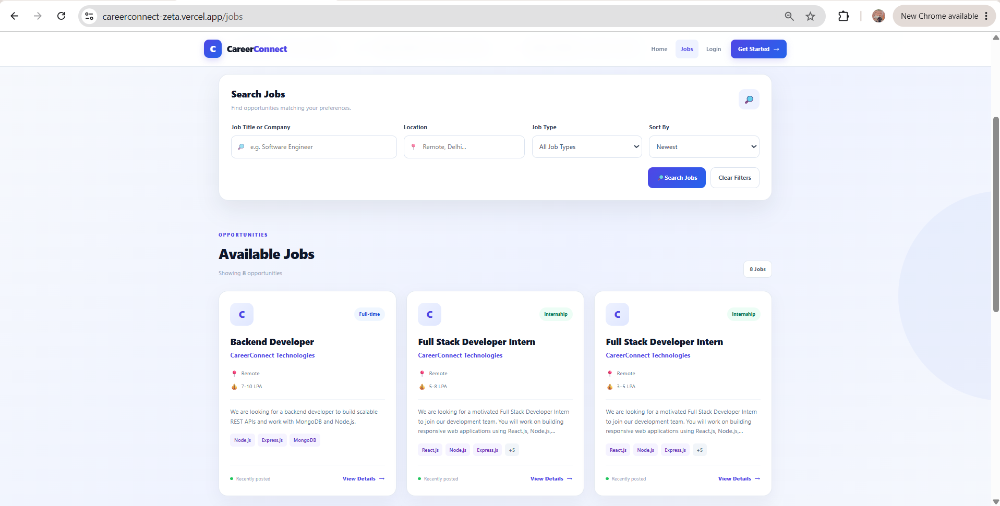
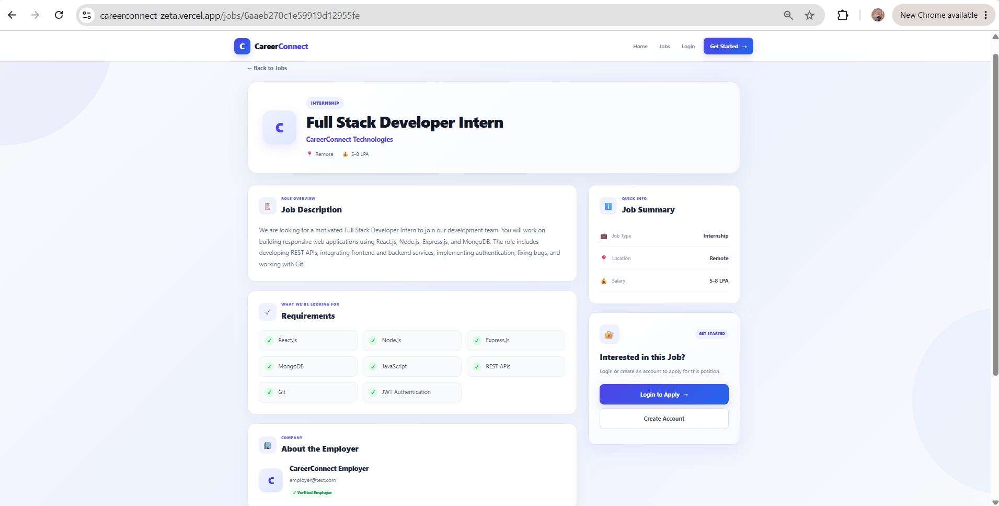
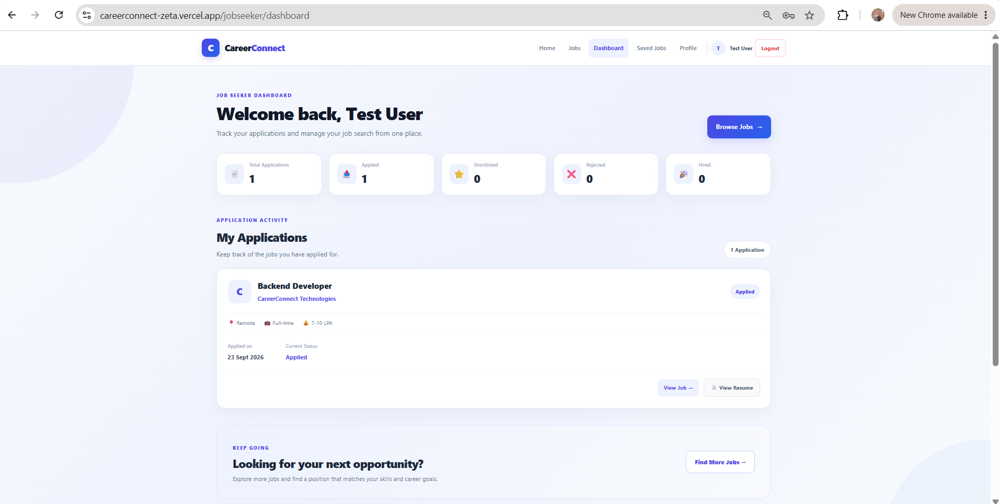
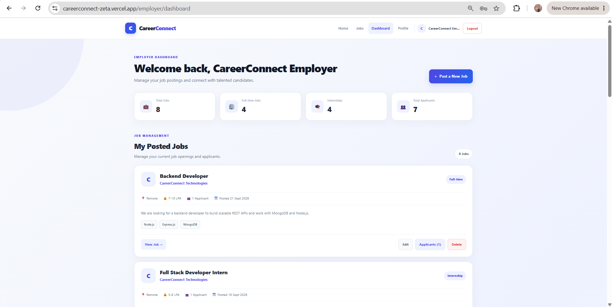
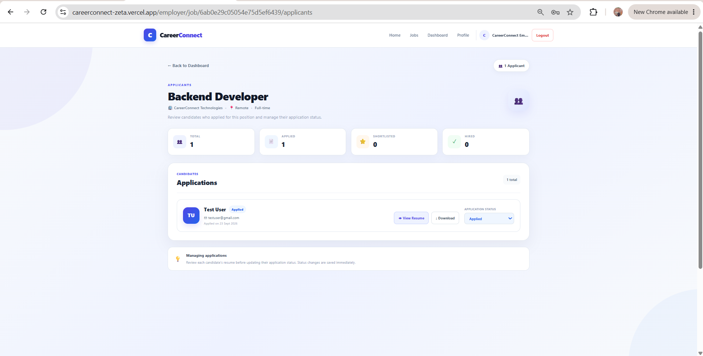
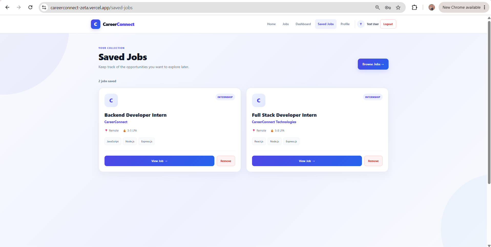
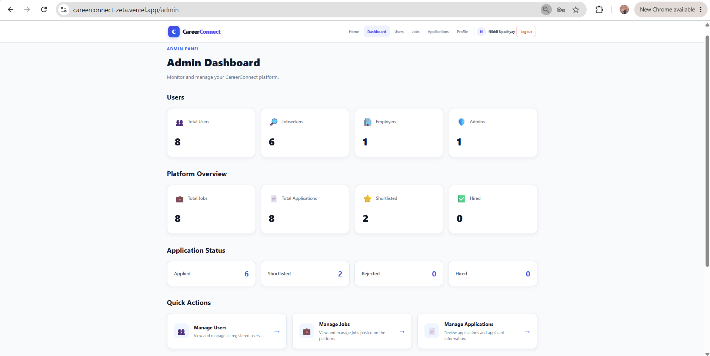
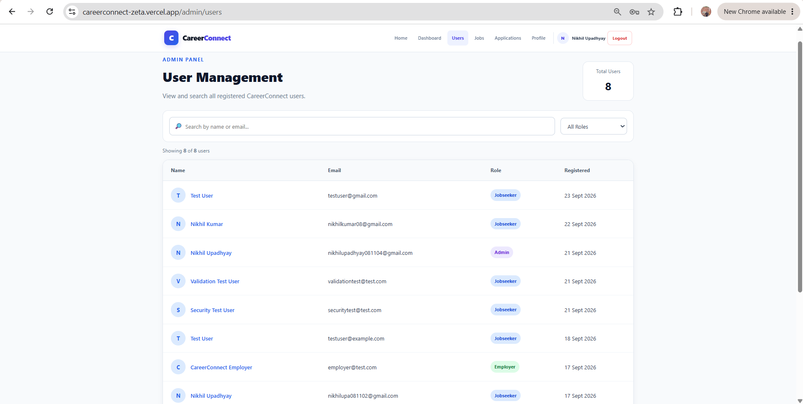
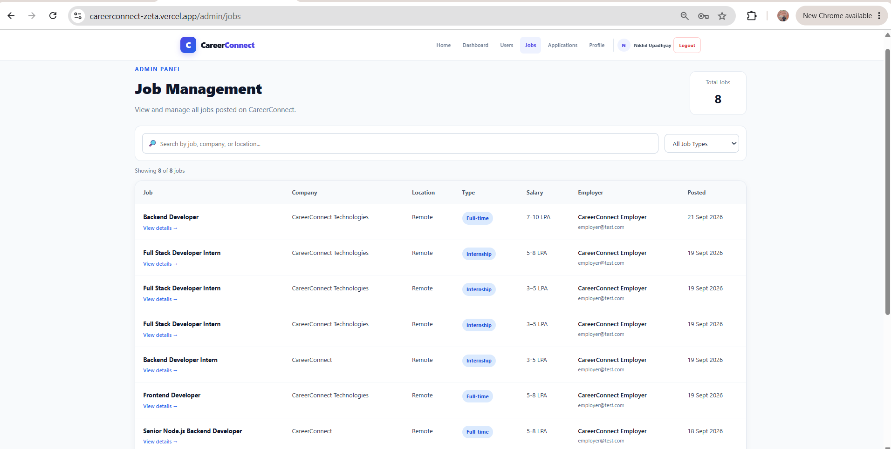

# CareerConnect

CareerConnect is a full-stack MERN job portal that connects job seekers and employers through a secure, role-based recruitment platform.

The platform allows job seekers to discover and apply for jobs, save jobs for later, manage applications, and maintain their profiles. Employers can create and manage job postings, view applicants, and update application statuses.

---

## 🚀 Features

### 👤 Authentication & Authorization

- User registration and login
- JWT-based authentication
- Password hashing using bcrypt
- Role-based access control
- Separate workflows for Job Seekers and Employers
- Admin role and protected admin routes
- Protected routes
- Forgot password functionality
- Password reset through email

### 🔎 Job Seeker

- Browse available jobs
- Search jobs by title or company
- Filter jobs by location and job type
- Sort and paginate job listings
- View detailed job information
- Apply for jobs
- Upload resume in PDF format
- Track submitted applications
- View application status
- Save jobs for later
- View saved jobs
- Remove saved jobs
- Manage profile

### 🏢 Employer

- Create job postings
- Edit existing job postings
- Delete job postings
- View posted jobs
- View applicants for each job
- View applicant resumes
- Download applicant resumes
- Update application status
- Manage employer profile

### 📄 Resume Management

- PDF resume upload
- File type validation
- File size validation
- Cloudinary integration for cloud storage
- Resume viewing and downloading

### 🛡️ Admin

- Admin authentication and authorization
- View all users
- View user details
- View all jobs
- View job details
- View all applications
- View application details
- Platform administration

---

## 🛠️ Tech Stack

### Frontend

- React.js
- React Router
- JavaScript
- HTML5
- CSS3
- Vite

### Backend

- Node.js
- Express.js
- MongoDB
- Mongoose
- JWT
- bcryptjs
- Multer
- Express Validator
- Helmet
- Express Rate Limit
- Nodemailer

### Cloud & Tools

- MongoDB Atlas
- Cloudinary
- Git
- GitHub
- Postman
- Vercel
- Render

---

## 🏗️ Project Structure

```text
CareerConnect/
│
├── backend/
│   ├── config/
│   ├── controllers/
│   ├── middleware/
│   ├── models/
│   ├── routes/
│   ├── utils/
│   ├── .env.example
│   ├── .gitignore
│   ├── package.json
│   └── server.js
│
├── frontend/
│   ├── public/
│   ├── src/
│   │   ├── assets/
│   │   ├── components/
│   │   ├── context/
│   │   ├── pages/
│   │   └── services/
│   ├── .env.example
│   ├── .gitignore
│   ├── package.json
│   ├── vercel.json
│   └── vite.config.js
│
├── Screenshots/
│   ├── home.png
│   ├── jobs.png
│   ├── job-details.png
│   ├── jobseeker-dashboard.png
│   ├── employer-dashboard.png
│   ├── applicants.png
│   ├── saved-jobs.png
│   ├── admin-dashboard.png
│   ├── admin-users.png
│   └── admin-jobs.png
│
├── .gitignore
└── README.md
```

---

## 📸 Screenshots

### 🏠 Home Page


### 🔎 Jobs Page



### 📄 Job Details



### 👤 Job Seeker Dashboard



### 🏢 Employer Dashboard



### 👥 Applicants Management



### 🔖 Saved Jobs



### 🛡️ Admin Dashboard



### 👥 Admin Users



### 💼 Admin Jobs



---

## 🔐 Authentication

CareerConnect uses JWT-based authentication to secure protected resources.

The application supports the following roles:

- **Job Seeker**
- **Employer**
- **Admin**

Protected backend routes require a valid JWT token.

Role-based authorization ensures that users can only access functionality available to their assigned role.

---

## ⚙️ Getting Started

### Prerequisites

Make sure you have installed:

- Node.js
- npm
- MongoDB Atlas account
- Cloudinary account
- Git

### 1. Clone the Repository

```bash
git clone https://github.com/Nikhilupadhyay08/CareerConnect.git
cd CareerConnect
```

### 2. Backend Setup

Navigate to the backend directory:

```bash
cd backend
```

Install dependencies:

```bash
npm install
```

Create a `.env` file inside the `backend` folder.

Example:

```env
PORT=4000

MONGO_URI=your_mongodb_connection_string

JWT_SECRET=your_jwt_secret

CLOUDINARY_CLOUD_NAME=your_cloudinary_cloud_name
CLOUDINARY_API_KEY=your_cloudinary_api_key
CLOUDINARY_API_SECRET=your_cloudinary_api_secret

SMTP_HOST=your_smtp_host
SMTP_PORT=587
SMTP_USER=your_smtp_username
SMTP_PASSWORD=your_smtp_password

ADMIN_EMAIL=your_admin_email
ADMIN_PASSWORD=your_admin_password

FRONTEND_URL=http://localhost:5173
```

Start the backend:

```bash
npm run dev
```

The backend will run on:

```text
http://localhost:4000
```

### 3. Frontend Setup

Open another terminal and navigate to the frontend:

```bash
cd frontend
```

Install dependencies:

```bash
npm install
```

Create a `.env` file inside the `frontend` folder:

```env
VITE_API_URL=http://localhost:4000/api
```

Start the frontend:

```bash
npm run dev
```

The frontend will run on:

```text
http://localhost:5173
```

---

## 📡 API Overview

### Authentication

```text
POST   /api/auth/register
POST   /api/auth/login
GET    /api/auth/profile
PATCH  /api/auth/profile
POST   /api/auth/forgot-password
POST   /api/auth/reset-password/:token
```

### Jobs

```text
GET    /api/jobs
GET    /api/jobs/:id
GET    /api/jobs/my-jobs
POST   /api/jobs
PATCH  /api/jobs/:id
DELETE /api/jobs/:id
```

### Applications

```text
POST   /api/applications
GET    /api/applications/my-applications
GET    /api/applications/job/:jobId
PATCH  /api/applications/:applicationId/status
GET    /api/applications/:applicationId/resume/view
GET    /api/applications/:applicationId/resume/download
```

### Saved Jobs

```text
POST   /api/saved-jobs/:jobId
DELETE /api/saved-jobs/:jobId
GET    /api/saved-jobs
GET    /api/saved-jobs/:jobId
```

### Admin

```text
GET    /api/admin/users
GET    /api/admin/jobs
GET    /api/admin/applications
GET    /api/admin/stats
```

---

## 🔒 Security

CareerConnect includes several security measures:

- Passwords are hashed using bcrypt
- JWT authentication protects private routes
- Role-based authorization restricts access to protected functionality
- Environment variables are excluded from Git
- Resume uploads are restricted to PDF files
- Resume upload size is limited to 5 MB
- Helmet is used for HTTP security headers
- API rate limiting is implemented
- Input validation is implemented
- Protected API endpoints require authentication

---

## 🧪 Testing

Backend APIs were tested using Postman, including:

- User registration
- User login
- JWT protected routes
- Forgot password
- Password reset
- Job creation
- Job updates
- Job deletion
- Job searching and filtering
- Resume uploads
- Job applications
- Applicant management
- Application status updates
- Saved jobs
- Resume viewing and downloading

---

## ☁️ Deployment

CareerConnect is deployed using:

- **Frontend:** Vercel
- **Backend:** Render
- **Database:** MongoDB Atlas
- **Resume Storage:** Cloudinary

### Live Application

https://careerconnect-zeta.vercel.app/

### Backend

https://careerconnect-backend-ywo1.onrender.com/

---

## 🔮 Future Improvements

- Advanced job recommendations
- Employer analytics dashboard
- Advanced candidate search
- Application activity timeline
- Real-time notifications
- Improved job recommendation system
- Additional employer analytics

---

## 👨‍💻 Author

**Nikhil Upadhyay**

Computer Science graduate focused on full-stack web development and software engineering.

### GitHub

https://github.com/Nikhilupadhyay08

### LeetCode

https://leetcode.com/u/nikhilup_08/